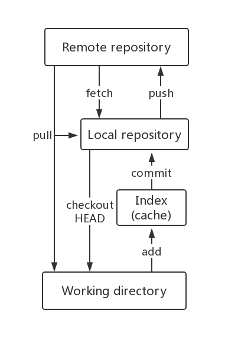

### 1. Git分区：

 工作区 (Working directory)：本地数据或者代码编辑区，数据或者代码操作区。
	暂存区 (Index cache)：数据或者代码暂时存放区。
	版本库 (Local repository)：存放已经提交的数据或者代码，此区数据或者代码直接push到远程仓库。
	分区之间数据传递流程图如下：
###### 
### 2.  Git命令：

#### (1) 基本操作
```
	git init                      //创建空仓库，当前目录下多出 .git 目录 

	git add <file>                //将文件添加到缓存 

	git status                    //查看在你上次提交之后是否有修改 

	git diff                      //查看尚未缓存的修改

	git diff --cached             //查看已经缓存的修改

	git diff HEAD                 //查看已缓存和未缓存的所有修改

	git diff --stat               //统计哪些文件发生了改变，有多少行产生了改动，并不会给出改动的具体内容

	git commit -m"message"        //缓存区内容添加到仓库中

	git commit -a                 //跳过 git add 提交缓存，直接commit

	git reset HEAD  <file>        //取消之前 git add 添加，但不希望包含在下一提交快照中的缓存

	git rm <file>                 //从工作目录中手工删除文件

	git rm -f <file>              //强制删除之前修改过并且已经放到暂存区域的文件

	git rm --cached <file>        //把文件从暂存区域移除，但仍然保留在当前工作目录中

	git rm –r *                   //删除整个目录中的所有子目录和文件

	git mv                        //移动或重命名一个文件、目录、软连接

```

#### (2) 分支管理
```
	git branch (branchname)        //创建分支

	git checkout (branchname)      //切换分支

	git checkout -b (branchname)   //加上-b参数表示创建并切换分支

	git branch                     //列出所有分支，当前分支前面会标一个*号

	git merge  (branchname)        //合并指定分支(branchname)到当前分支

	git branch -d (branchname)     //删除分支

```

#### (3) 查看历史提交
```
	git log                         //查看提交历史

	git log --oneline               //查看简洁的历史提交信息

	git log --graph                 //查看分支合并图

	git log --reverse --oneline     //逆向显示所有日志

	git log --author                //查看指定用户的提交日志

	git log --oneline --before={starttime}  --after={endtime}

	git log --oneline --until={starttime}  --after={endtime}      //查看时间段的历史提交，后面加 --no-merges 选项以隐藏合并提交

```

#### (4) 添加标签
```
	git tag -a <tagname>                   //-a 选项意为创建一个带注解的标签，不用 -a 选项也可以执行的，但它不会记录这标签是啥时候打的，谁打的，也不会让你添加个标签的注解

	git tag                                //查看所有标签

	git tag -a <tagname> -m"标签信息"       //指定标签信息

```

#### (5) Git 远程仓库
```
	git remote add [alias] [url]      //添加一个新的远程仓库， alias为远程仓库别名

	git remote                        //查看当前配置的远程仓库

	git fetch                         //从远程仓库下载新分支与数据，执行完后需要执行git merge 远程分支到你所在的分支

	git push [alias] [branchname]     //推送新分支与数据到某个远端仓库

	git remote rm [alias]             //删除远程仓库 

```

#### (6) Git rebase

假设现在基于远程分支 *origin* ，创建一个叫 *mybranch* 的分支，然后在这个分支做一些修改。然后生成若干个提交 **(commit)**，但是与此同时，有些人也在 *origin* 分支上做了一些修改并且做了提交了。
这就意味着 *origin* 和 *mybranch* 这两个分支各自<前进> 了，它们之间<分叉> 了。你可以用 *pull* 命令把 *origin* 分支上的修改拉下来并且和你的修改合并。
结果看起来就像一个新的 *合并的提交* **(merge commit)**。如果你想让 *mybranch* 分支历史看起来像没有经过任何合并一样，可以用 git rebase ：
```
	git rebase origin

```
该命令会把你的 *mybranch* 分支里的每个提交 **(commit)** 取消掉，并且把它们临时保存为补丁 **(patch)** ( 这些补丁放到" .git/rebase "目录中 )。
然后把 *mybranch* 分支更新到最新的 *origin* 分支，最后把保存的这些补丁应用到 *mybranch* 分支上。
当 *mybranch* 分支更新之后，它会指向这些新创建的提交 **(commit)**, 而那些老的提交会被丢弃。 如果运行垃圾收集命令 **(pruning garbage collection)**, 这些被丢弃的提交就会删除。
在 **rebase** 的过程中，也许会出现冲突 **(conflict)**. 在这种情况，Git 会停止 rebase 并会让你去解决冲突；在解决完冲突后，用 **git-add** 命令去更新这些内容的索引 (index), 然后，你无需执行**git-commit** ,只要执行 **continue** 命令，这样 git 会继续应用 **(apply)** 余下的补丁：

```
	git rebase --continue

```
任何时候，可以用** --abort **参数来终止 rebase 的行动，并且 *mybranch* 分支会回到 rebase 开始前的状态。
```
	git rebase --abort

```