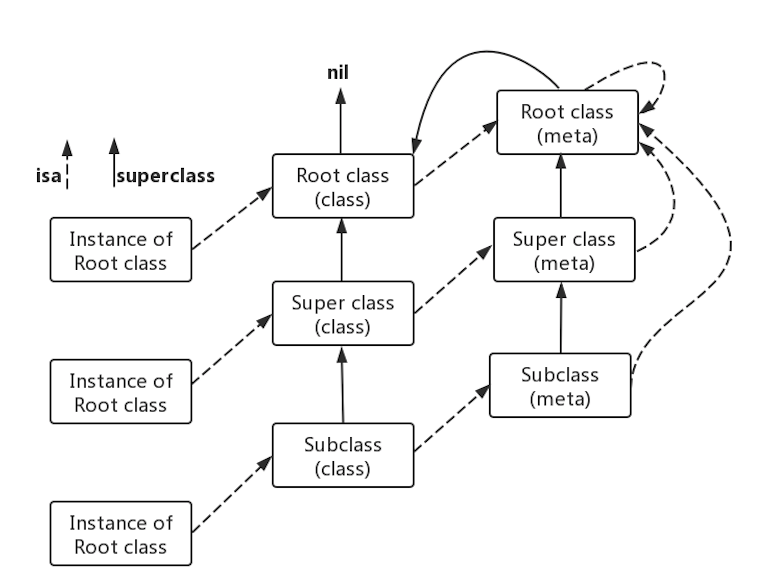

## Objc Runtime
  源代码下载地址：[http://www.opensource.apple.com/source/objc4/](http://www.opensource.apple.com/source/objc4/)

  Runtime 函数文档: [https://developer.apple.com/documentation/objectivec/objective-c_runtime](https://developer.apple.com/documentation/objectivec/objective-c_runtime)

  苹果官方 Runtime 编程指南：
  [https://developer.apple.com/library/archive/documentation/Cocoa/Conceptual/ObjCRuntimeGuide/Introduction/Introduction.html#//apple_ref/doc/uid/TP40008048](https://developer.apple.com/library/archive/documentation/Cocoa/Conceptual/ObjCRuntimeGuide/Introduction/Introduction.html#//apple_ref/doc/uid/TP40008048)
### 1. 概念
 Objective-C 是一门动态语言，它将很多静态语言在编译和链接时做的事情推迟到运行时来处理。

 这种动态特性意味着 Objective-C 不仅需要一个编译器，还需要一个运行时系统来执行编译的代码。
 对于 Objective-C 来说，这个运行时系统就像一个操作系统一样：它让所有的工作可以正常的运行。

 Runtime 就是使用 C 和汇编写的一个运行时库，一般我们说 Runtime，不但包含运行时库的意思，还包含了运行时、运行时系统等概念。

**Objc Runtime 使得 C 具有了面向对象能力，可以在程序运行时创建、检查、修改类、对象和它们的方法**。

### 2. Runtime 的作用：
#### (1) 封装
 Runtime 库中，对象可以用 C 语言中的结构体表示，而方法可以用 C 函数来实现，再加上了一些其他的特性。这些结构体和函数被 runtime 函数封装后，就可以在程序运行时创建、检查、修改类、对象和它们的方法了。
#### (2) 找到方法的最终执行代码
 当程序中执行 [receiver message] 时，会向消息接收者（receiver）发送一条消息 message，runtime 会根据消息接收者是否能响应该消息而做出不同的反应，即消息转发的流程。
### 3. 类和对象（Class 和 Object）相关的基本数据结构
#### (1) 关键词：
 Class：指向了 objc_class 结构体的指针 
	id：参数类型，指向某个类实例的指针 
	Method：代表了类中的某个方法的类型
	SEL：方法选择器，全名是 selector
	IMP：函数指针，由编译器生成，方法实现的代码就是由 IMP 指定
	Ivar：成员变量的类型
	Property：属性存储器
	Cache：方法调用的缓存器，为方法调用的性能进行优化

#### (2) objc_class 和 objc_object 数据结构：
```
typedef struct objc_class *Class;
typedef struct objc_object *id;
```
#### (3) objc_object 和 isa
objc_object 源代码在 objc-private.h line 75, 关键代码如下：
```
struct objc_object {
private:
    isa_t isa;

public:

    // ISA() assumes this is NOT a tagged pointer object
    Class ISA();

    // getIsa() allows this to be a tagged pointer object
    Class getIsa();
}
```
objc_object 中的 isa，对应类型为联合体 isa_t，源代码在 objc-private.h line 61, 关键代码定义如下：
```
struct {
    uintptr_t nonpointer        : 1;                                         \         //0:普通指针，1:优化过，使用位域存储更多信息
    uintptr_t has_assoc         : 1;                                         \         //对象是否含有或曾经含有关联引用
    uintptr_t has_cxx_dtor      : 1;                                         \         //表示是否有 C++ 析构函数或OC的 dealloc
    uintptr_t shiftcls          : 44; /*MACH_VM_MAX_ADDRESS 0x7fffffe00000*/ \         //存放着 Class、Meta-Class 对象的内存地址信息
    uintptr_t magic             : 6;                                         \         //用于在调试时分辨对象是否未完成初始化
    uintptr_t weakly_referenced : 1;                                         \         //是否被弱引用指向
    uintptr_t deallocating      : 1;                                         \         //对象是否正在释放
    uintptr_t has_sidetable_rc  : 1;                                         \         //是否需要使用 sidetable 来存储引用计数
    uintptr_t extra_rc          : 8                                                    //引用计数能够用 8 个二进制位存储时，直接存储在这里
}
```
#### (4) objc_class
objc_class 源代码可在 objc-runtime-new.h line 1111 看到，由于 objc_class 继承自 objc_object， 所以其关键结构可简化如下:
```
struct objc_class : objc_object {
    isa_t isa;                 // Class ISA;
    Class superclass;
    cache_t cache;             // formerly cache pointer and vtable
    class_data_bits_t bits;    // class_rw_t * plus custom rr/alloc flags

    class_rw_t *data() { 
        return bits.data();
    }
}
```
objc_object 用来描述 OC 中的实例，当用口语描述实例时，总会说 「XX类的实例x」或「x是XX的实例」。objc_object 的 isa 在程序结构上表达类似的含义，它指向了该实例所对应的类，类在 runtime 中被描述成 objc_class 结构。
Objective-C 中的类本质上也是对象，称之为类对象，在 Objective-C 中有一个非常特殊的类 NSObject ，绝大部分的类都继承自它。它是 Objective-C 中的两个根类（rootclass）之一，另外一个是 NSProxy。
NSObject 只有一个成员变量 isa。所有继承自 NSObject 的类也都会有这个成员变量。

#### (5) 元类（metaclass），根类（root class），根元类（root metaclass）
本质上 Objective-C 中的类也是对象，它也是某个类的实例，这个类我们称之为元类（metaclass）。元类也是对象（元类对象），元类也是某个类的实例，这个类我们称之为根元类（root metaclass）。
不过，有一点比较特殊，那就是所有的元类所属的类都是同一个根元类（当然根元类也是元类，所以它所属的类也是根元类，即它本身）。根元类指的就是根类的元类，具体来说就是根类 NSObject 对应的元类。

通过调用类方法，比如 [NSObject new]，给类对象发送消息。同样的，类对象能否响应这个消息也要通过 isa 找到类对象所属的类（元类）才能知道。也就是说，实例方法是保存在类中的，而类方法是保存在元类中的。理论上我们也可以给元类发送消息，但是 Objective-C 倾向于隐藏元类，不想让大家知道元类的存在。元类是为了保持 Objective-C 对象模型在设计上的完整性而引入的，比如用来保存类方法等，它主要是用来给编译器使用的。

下图是为类（class），元类（metaclass），根类（root class），根元类（root metaclass）关系

#### (6) superclass
指向该类的父类，如果该类已经是最顶层的根类（如 NSObject 或 NSProxy），则 superclass 为 NULL。
#### (7) cache_t
cache_t 是一个散列表，用来缓存曾经调用过的方法，提高方法的查找速度。
源代码可在 objc-runtime-new.h line 59 找到，其关键结构如下:
```
struct cache_t {
    struct bucket_t *_buckets;     // 散列表
    mask_t _mask;                  // 散列表的长度 -1
    mask_t _occupied;              // 已经缓存的方法数量
}

struct bucket_t {
    cache_key_t _key;              // SEL 作为 key
    MethodCacheIMP _imp;           // 函数的内存地址
};
```
**buckets：**指向 Method 数据结构指针的数组。这个数组可能包含不超过 mask+1 个元素。需要注意的是，指针可能是 NULL，表示这个缓存 bucket 没有被占用，另外被占用的 bucket 可能是不连续的。这个数组可能会随着时间而增长。

**mask：**一个整数，指定分配的缓存 bucket 的总数。在方法查找过程中，Objective-C runtime 使用这个字段来确定开始线性查找数组的索引未知。指向方法 selector 的指针与该字段做一个 AND 位操作（index = (mask & selector)）。这可以作为一个简单的 hash 散列算法。

**occupied：**一个整数，指定实际占用的缓存 bucket 的总数。

#### (8) class_data_bits_t
class_data_bits_t 是一个结构体，里面包含了一个 class_rw_t 类型的指针 data。class_rw_t 内部有个 class_ro_t 的指针 ro。class_rw_t 是可读可写的，class_ro_t 是只读的。 class_data_bits_t 源代码可以在 objc-runtime-new.h line 870 看到。

**class_rw_t** 结构如下：
```
struct class_rw_t {
    // Be warned that Symbolication knows the layout of this structure.
    uint32_t flags;
    uint32_t version;

    const class_ro_t *ro;             // 保存类的原始数据(不包含分类内容和动态添加的方法)
    method_array_t methods;           // 方法列表(如果是类对象存储的是对象方法,元类对象存储的是类方法)
    property_array_t properties;      // 属性列表
    protocol_array_t protocols;       // 协议列表
    Class firstSubclass;              // 第一个子类
    Class nextSiblingClass;           // 兄弟类
}

```

**class_ro_t** 储存了类的初始信息，不包括分类和后来动态添加的内容。class_ro_t 关键代码如下：
```
struct class_ro_t {
    uint32_t flags;
    uint32_t instanceStart;
    uint32_t instanceSize;
#ifdef __LP64__
    uint32_t reserved;
#endif

    const uint8_t * ivarLayout;
    
    const char * name;                    // 类名
    method_list_t * baseMethodList;       // 原始方法列表
    protocol_list_t * baseProtocols;      // 原始协议列表
    const ivar_list_t * ivars;            // 成员变量列表

    const uint8_t * weakIvarLayout;
    property_list_t *baseProperties;      // 属性列表

    method_list_t *baseMethods() const {
        return baseMethodList;
    }
}

```
**method_list_t** 数组包含了多个 method_t，其中 method_t 也是结构体 ，其关键结构如下：
```
struct method_t {
    SEL name;               // 函数名
    const char *types;      // 方法参数 (包含了返回值类型,参数类型)
    MethodListIMP imp;      // 方法的实现 (指向函数的指针)
}
```
**ivar_list_t** 数组包含了多个 ivar_t 类型的结构体 ivar，ivar_t 结构如下：

```
struct ivar_t {
    int32_t *offset;               // 变量在内存中相对所属对象内存空间起始地址的偏移量,偏移量大小根据类型来定
    const char *name;              // 变量名
    const char *type;              // 变量类型
    // alignment is sometimes -1; use alignment() instead
    uint32_t alignment_raw;
    uint32_t size;

    uint32_t alignment() const {
        if (alignment_raw == ~(uint32_t)0) return 1U << WORD_SHIFT;
        return 1 << alignment_raw;
    }
}
```
**property_list_t** 数组包含多个 property_t，property_t 结构如下：
```
struct property_t {
    const char *name;             
    const char *attributes;        
}
```

class_ro_t 包含的类信息（方法、属性、协议等）都是在编译期就可以确定的，暂且称为元信息吧，在之后的逻辑中，它们显然是不希望被改变的；后续在用户层，无论是方法还是别的扩展，都是在 class_rw_t 上进行操作，这些操作都不会影响类的元信息。更多关于 class_rw_t 和 class_ro_t 的资料可查看 [这篇文章](https://zhangbuhuai.com/post/runtime.html)。

### 4. 类和对象相关操作方法
操作类相关的函数一般以 class 为前缀，操作对象相关函数以 objc 或 object_ 为前缀。可在开篇 Runtime 函数文档查看相关方法。

#### (1) 类相关操作函数	
```
	const char * class_getName ( Class cls )           // 获取类名

	Class class_getSuperclass ( Class cls )            // 获取父类

	BOOL class_isMetaClass ( Class cls )               // 判断给定的类是不是元类

	size_t class_getInstanceSize ( Class cls )         // 获取类的实例大小

	int class_getVersion ( Class cls )                 // 获取版本号

	void class_setVersion ( Class cls, int version )   // 设置版本号


```

#### (2) 成员变量 (ivars) 和属性相关操作函数
```
	Ivar class_getInstanceVariable ( Class cls, const char *name )                                           // 获取类中指定名称实例成员变量的信息

	Ivar class_getClassVariable ( Class cls, const char *name )                                              // 获取类成员变量的信息

	BOOL class_addIvar ( Class cls, const char *name, size_t size, uint8_t alignment, const char *types )    // 在 runtime 时创建的类添加成员变量

	Ivar * class_copyIvarList ( Class cls, unsigned int *outCount )                                          // 获取整个成员变量列表，必须使用 free() 来释放


```
#### (3) method 相关操作函数
```
	BOOL class_addMethod ( Class cls, SEL name, IMP imp, const char *types )       // 添加方法，和成员变量不同的是可以为类动态添加方法。如果有同名会返回 NO，修改的话需要使用 method_setImplementation

	Method class_getInstanceMethod ( Class cls, SEL name )                         // 获取实例方法

	Method class_getClassMethod ( Class cls, SEL name )                            // 获取类方法

	Method * class_copyMethodList ( Class cls, unsigned int *outCount )            // 获取所有方法

	IMP class_replaceMethod ( Class cls, SEL name, IMP imp, const char *types )    // 实现替换方法

	IMP class_getMethodImplementation ( Class cls, SEL name )                      // 返回方法的具体实现

	IMP class_getMethodImplementation_stret ( Class cls, SEL name )                // 返回方法的具体实现

	BOOL class_respondsToSelector ( Class cls, SEL sel )                           // 类实例是否响应指定的 selector


```
#### (4) protocol 相关操作函数
```
	BOOL class_addProtocol ( Class cls, Protocol *protocol )                       // 添加协议

	BOOL class_conformsToProtocol ( Class cls, Protocol *protocol )                // 返回类是否实现指定的协议

	Protocol * class_copyProtocolList ( Class cls, unsigned int *outCount )        // 获取类实现的协议列表


```

#### (5) 相关示例代码：
```
	// TODO：贴代码
```
### 5. 消息与消息转发
#### (1) Method 基础数据结构：
  Method 是 method_t 结构体的指针，method_t 在分析 method_list_t 已写出其结构，其结构中包括 SEL 和 IMP 两种数据结构。

**SEL:**
Objective-C 在编译的时候，objc_selector 会依据方法的名字、参数序列、生成一个整型标识的地址
( int 类型的地址)：这个标识就是 SEL，其结构如下：

```
	typedef struct objc_selector *SEL
```
**IMP：**
是一个函数指针，指向方法实现的地址。其结构如下：
```
	/// A pointer to the function of a method implementation. 
	#if !OBJC_OLD_DISPATCH_PROTOTYPES
	typedef void (*IMP)(void /* id, SEL, ... */ ); 
	#else
	typedef id _Nullable (*IMP)(id _Nonnull, SEL _Nonnull, ...); 
	#endif
```
**SEL 和 IMP 为映射关系：**SEL 通过 Dispatch table 表寻找到对应的 IMP， Dispatch table 表存放 SEL 和 IMP 的映射。我们可以对一个编号 (SEL) 和什么方法 (IMP) 映射做些操作，也就是说我们可以一个 SEL 指向不同的函数指针，这样就可以完成一个方法名在不同时候执行不同的函数体。
#### (2) 相关操作方法：
```
	// 调用指定方法的实现，返回的是方法实现时的返回，参数 receiver 不能为空，这个比 method_getImplementation 和 method_getName 速度快
	void method_invoke_stret ( id receiver, Method m, ... )

	// 调用返回一个数据结构的方法的实现              
	id method_invoke ( id receiver, Method m, ... )           

	// 获取方法名，希望获得方法名的 C 字符串，使用 sel_getName(method_getName(method))          
	SEL method_getName ( Method m )                   

	// 返回方法的实现                  
	IMP method_getImplementation ( Method m )    

	// 获取描述方法参数和返回值类型的字符串                        
	const char * method_getTypeEncoding ( Method m )    

	// 获取方法的返回值类型的字符串                 
	char * method_copyReturnType ( Method m )         

	// 获取方法的指定位置参数的类型字符串                    
	char * method_copyArgumentType ( Method m, unsigned int index )      

	// 通过引用返回方法的返回值类型字符串
	void method_getReturnType ( Method m, char *dst, size_t dst_len )    

	// 返回方法的参数的个数
	unsigned int method_getNumberOfArguments ( Method m )               

	// 通过引用返回方法指定位置参数的类型字符串
	void method_getArgumentType ( Method m, unsigned int index, char *dst, size_t dst_len )

	// 返回指定方法的方法描述结构体
	struct objc_method_description * method_getDescription ( Method m )  

	// 设置方法的实现
	IMP method_setImplementation ( Method m, IMP imp )           

	// 交换两个方法的实现
	void method_exchangeImplementations ( Method m1, Method m2 )     

	// 返回给定选择器指定的方法的名称    
	const char * sel_getName ( SEL sel )          

	// 返回 Runtime 系统中注册的方法，方法名映射的选择器                       
	SEL sel_registerName ( const char *str )                             

	// Runtime 系统中注册一个方法
	SEL sel_getUid ( const char *str )           

	// 比较两个选择器                        
	BOOL sel_isEqual ( SEL lhs, SEL rhs )                               
```
#### (3) 相关操作代码示例：
```
	// TODO：贴代码
```
#### (4) Method 调用流程：
**objc_msgSend 函数：** 这个函数将消息接收者和方法名作为基础参数。消息发送给一个对象时，objc_msgSend 通过对象的 isa 指针获得类的结构体，先在 Cache 里找，找到就执行，没找到就在分发列表里查找方法的 selector，没找到就通过 objc_msgSend 结构体中指向父类的指针找到父类，然后在父类分发列表找，直到 root class（NSObject）。Objc 中发送消息是用中括号把接收者和消息括起来，只到运行时才会把消息和方法实现绑定。为了加快速度，苹果对这个方法做了很多优化，这个方法是用汇编实现的。
objc_msgSend 定义如下：
```
	objc_msgSend(receiver, selector, arg1, arg2, ...)
```
objc_msgSend 内部实现大致流程：首先在 Class 中的缓存查找 imp（没缓存则初始化缓存），如果没找到就去父类的 Class 查找，如果一直查到到根类仍旧没有实现，则用 *_objc_msgForward* 函数指针代替 imp， 最后执行 imp。 *_objc_msgForward*  是用于消息转发的，当方法没有被寻找到的时候，就会触发消息转发流程。

**消息转发流程：**当一个对象能接收一个消息时，就会走正常的方法调用流程。但如果一个对象无法接收指定消息，如果是以 [receiver message] 的方式调用方法，那么如果 receiver 无法响应 message 消息时，编译器就会报错。但如果是 perform... 的形式来调用，则需要等到运行时才能确定 receiver 是否能接受 message 消息。如果不能，则程序崩溃。消息转发的流程，可以分为三个阶段: 方法解析、重定向、消息转发。

*tips:* 通常，当不能确定一个对象是否能接收某个消息时，会先调用 respondsToSelector: 来判断一下：
```
if ([self respondsToSelector:@selector(method)]) {
    [self performSelector:@selector(method)];
}
```
**方法解析：**当 runtime 在方法缓存列表和方法分发列表（包括超类）中找不到要执行的方法时，首先会进入方法解析阶段，此时可以在方法解析中动态添加方法实现。具体操作的函数如下：
```
	// 实例方法找不到实现的情况，可以在方法解析中动态添加方法实现
	+ (BOOL)resolveInstanceMethod:(SEL)sel     

	//类方法找不到实现的情况，可以在方法解析中动态添加方法实现
	+ (BOOL)resolveClassMethod:(SEL)sel

	//动态添加一个方法，Class cls 是要指定的类，runtime 会到这个类中去找方法， SEL name 是要解析的方法，IMP 是动态添加的方法实现的 imp ，const char *types : 类型编码，是个字符串
	class_addMethod(Class cls, SEL name, IMP imp, const char *types)      
```
[类型编码文档](https://developer.apple.com/library/archive/documentation/Cocoa/Conceptual/ObjCRuntimeGuide/Articles/ocrtTypeEncodings.html#//apple_ref/doc/uid/TP40008048-CH100-SW1)

**重定向：**在消息转发机制执行前，系统会再给我们一次偷梁换柱的机会通过重载 *forwardingTargetForSelector* 方法替换消息的接受者为其他对象，毕竟消息转发需要耗费更多的时间，如果此方法返回 nil 或是 self，则会进入消息转发阶段。但是替换的对象千万不要是 self，那样会进入死循环。
```
- (id)forwardingTargetForSelector:(SEL)aSelector {
    if (aSelector == @selector(mysteriousMethod:)) {
       return alternateObject;
    }
    return [super forwardingTargetForSelector:aSelector];
}
```
**消息转发：**
如果以上两种都没法处理未知消息就需要完整消息转发了，调用如下方法：
``` 
	//这一步是最后机会将消息转发给其它对象，对象会将未处理的消息相关的 selector，target 和参数都封装在 anInvocation 中。forwardInvocation :像未知消息分发中心，将未知消息转发给其它对象。注意的是 forwardInvocation: 方法只有在消息接收对象无法正常响应消息时才被调用。
	- (void)forwardInvocation:(NSInvocation *)anInvocation

	//必须重写这个方法，消息转发使用这个方法获得的信息创建 NSInvocation 对象。
	- (NSMethodSignature *)methodSignatureForSelector:(SEL)aSelector
```
[消息转发更详细资料](http://yulingtianxia.com/blog/2016/06/15/Objective-C-Message-Sending-and-Forwarding/)

#### (5) Method Swizzling：
Objective-C 中的 Method Swizzling 允许我们动态地替换方法的实现，实现 Hook 功能，是一种比子类化更加灵活的“重写”方法的方式。讲 Method 结构的时候提到过：原则上方法的名称 name 和方法的实现 imp 是一一对应的，而 Method Swizzling 的原理就是动态地改变它们的对应关系，达到替换方法实现的目的，如下代码实现了 NSArray 异常操作的崩溃拦截功能：
```
#import "NSArray+SafeArray.h"
#import <objc/runtime.h>

/** 
 在 iOS 中 NSNumber、NSArray、NSDictionary 等这些类都是类簇，一个 NSArray 的实现可能由多个类组成。所以如果想对 NSArray 进行 Swizzling，必须获取到其“真身”进行 Swizzling，直接对 NSArray 进行操作是无效的。
 
 下面列举了 NSArray 和 NSDictionary 本类的类名，可以通过Runtime函数取出本类。
 NSArray                __NSArrayI
 NSMutableArray         __NSArrayM
 NSDictionary           __NSDictionaryI
 NSMutableDictionary	__NSDictionaryM
 */

@implementation NSArray (SafeArray)

// 注意下面的load方法中，不应该调用父类的load方法
+ (void)load {
    Method fromMethod = class_getInstanceMethod(objc_getClass("__NSArrayI"), @selector(objectAtIndex:));
    Method toMethod = class_getInstanceMethod(objc_getClass("__NSArrayI"), @selector(safe_objectAtIndex:));
    method_exchangeImplementations(fromMethod, toMethod);
}

// 为了避免和系统的方法冲突在 swizzling 方法前面加前缀
- (id)safe_objectAtIndex:(NSUInteger)index {
    if (self.count-1 < index) {
        // 如果越界就进入异常拦截
        @try {
            return [self safe_objectAtIndex:index];
        }
        @catch (NSException *exception) {
            // 崩溃后收集日志
            NSLog(@"---------- %s Crash Because Method %s  ----------\n", class_getName(self.class), __func__);
            NSLog(@"%@", [exception callStackSymbols]);
            return nil;
        }
        @finally {}
    } else {
        // 如果没有问题，则正常进行方法调用
        return [self safe_objectAtIndex:index];
    }
}
@end

```
**使用 Method Swizzling 注意的点：**
**1）在 +load 方法中实现 Method Swizzling 的逻辑而不是在 +initialize ：**
+load 和 +initialize 是 Objective-C runtime 会自动调用的两个类方法，但是它们的调用时机是不一样的。+load 方法是在类被加载的时候调用的，而 +initialize 方法是在类或它的子类收到第一条消息之前被调用的，这里所指的消息包括实例方法和类方法调用。也就是说 +initialize 方法是以懒加载的方式被调用的，如果程序一直没有给某个类或它的子类发送消息，那么这个类的 +initialize 方法是永远不会被调用的。此外 +load 方法还有一个非常重要的特性，那就是子类、父类和分类中的 +load 方法的实现是被区别对待的。也就是说在 Objective-C runtime 自动调用 +load 方法时，分类中的 +load 方法并不会对主类中的 +load 方法造成覆盖。所以在 +load 方法是实现 Method Swizzling 逻辑是最佳选择。
**2）用 dispatch_once 来进行调度：**
+load 方法在类加载的时候会被 runtime 自动调用一次，但是它并没有限制程序员对 +load 方法的手动调用，所以使用 dispatch_once 确保代码不管有多少线程都只被执行一次。
**3）需要调用 class_addMethod 方法，并且以它的结果为依据分别处理两种不同的情况：**
使用 Method Swizzling 的目的通常都是为了给程序增加功能，而不是完全替换某个功能，所以我们一般都需要在自定义的实现中调用原始的实现，所以这里就会有两种情况需要我们分别进行处理：
*第一种情况：*主类本身有实现需要替换的方法，也就是 class_addMethod 方法返回 NO 时，直接交换两个方法的实现就可以了。
*第二种情况：*主类本身没有实现需要替换的方法，而是继承了父类的实现，即 class_addMethod 方法返回 YES。这时调用 class_getInstanceMethod 函数获取到的 originalSelector 指向的就是父类的方法，我们再通过执行 lass_replaceMethod(class, swizzledSelector, method_getImplementation(originalMethod), method_getTypeEncoding(originalMethod)); 将父类的实现替换到我们自定义的方法中，这样就达到了在自定义方法的实现中调用父类实现的目的。
**4）Selector，Method 和 Implementation 的关系：**
一个类维护一个运行时可接收的消息分发表，分发表中每个入口是一个 Method，其中 key 是一个特定的名称即 SEL，与其对应的实现是 IMP 即指向底层 C 函数的指针。
### 6. Category 和 Protocol
#### (1) Category 数据结构：
```
struct category_t {
    const char *name; 
    classref_t cls;
    struct method_list_t *instanceMethods;         // 实例方法列表
    struct method_list_t *classMethods;            // 类方法列表，Meta Class方法列表的子集
    struct protocol_list_t *protocols;             // 分类所实现的协议列表
    struct property_list_t *instanceProperties;    
    // Fields below this point are not always present on disk.
    struct property_list_t *_classProperties;      

    method_list_t *methodsForMeta(bool isMeta) {
        if (isMeta) return classMethods;
        else return instanceMethods;
    }

    property_list_t *propertiesForMeta(bool isMeta, struct header_info *hi);
};
```
#### (2) Category 的用途：
 1) 给现有的类添加方法；
    2) 将一个类的实现拆分成多个独立的源文件；
    3) 声明私有的方法
    
*Tips:* Category 有一个非常容易误用的场景，那就是用 Category 来覆写父类或主类的方法。虽然目前 Objective-C 是允许这么做的，但是这种使用场景是非常不推荐的。使用 Category 来覆写方法有很多缺点，比如不能覆写 Category 中的方法、无法调用主类中的原始实现等，且很容易造成无法预估的行为。 
#### (3) Category 的实现原理：


### 7. Runtime 的应用

## Swift Runtime
