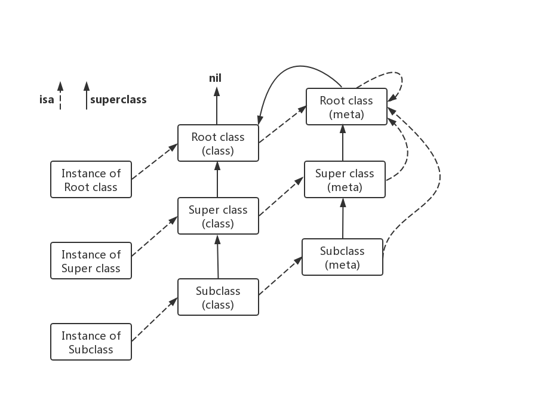

**Objc Runtime**

##  1.概念
	Objective-C 是一门动态语言，它将很多静态语言在编译和链接时做的事情推迟到运行时来处理。
	这种特性意味着 Objective-C 不仅需要一个编译器，还需要一个运行时系统来执行编译的代码。
	对于 Objective-C 来说，这个运行时系统就像一个操作系统一样：它让所有的工作可以正常的运行。
	Runtime就是使用 C 和汇编写的一个运行时库，一般我们说 Runtime，不但包含运行时库的意思，
	还包含了运行时、运行时系统等概念。Objc Runtime 使得 C 具有了面向对象能力，在程序运行时创建，
	检查，修改类、对象和它们的方法。

## 	2.数据结构
```
typedef struct objc_class *Class;
typedef struct objc_object *id;
```
 Class：指向了 objc_class 结构体的指针 
	id：参数类型，指向某个类实例的指针 
	Method：代表了类中的某个方法的类型
	SEL：方法选择器，全名是 selector
	IMP：函数指针，由编译器生成，方法实现的代码就是由 IMP 指定
	Ivar：成员变量的类型
	Property：属性存储器
	Cache：方法调用的缓存器，为方法调用的性能进行优化
### (1) objc_object 和 isa
objc_object 源代码在 objc-private.h line 75, 关键代码如下：
```
struct objc_object {
private:
    isa_t isa;

public:

    // ISA() assumes this is NOT a tagged pointer object
    Class ISA();

    // getIsa() allows this to be a tagged pointer object
    Class getIsa();
}
```
objc_object 中的 isa，对应类型为联合体 isa_t，源代码在 objc-private.h line 61, 关键代码定义如下：
```
struct {
	uintptr_t nonpointer        : 1;                                         \         //0:普通指针，1:优化过，使用位域存储更多信息
	uintptr_t has_assoc         : 1;                                         \         //对象是否含有或曾经含有关联引用
	uintptr_t has_cxx_dtor      : 1;                                         \         //表示是否有 C++ 析构函数或OC的 dealloc
	uintptr_t shiftcls          : 44; /*MACH_VM_MAX_ADDRESS 0x7fffffe00000*/ \         //存放着 Class、Meta-Class 对象的内存地址信息
	uintptr_t magic             : 6;                                         \         //用于在调试时分辨对象是否未完成初始化
	uintptr_t weakly_referenced : 1;                                         \         //是否被弱引用指向
	uintptr_t deallocating      : 1;                                         \         //对象是否正在释放
	uintptr_t has_sidetable_rc  : 1;                                         \         //是否需要使用 sidetable 来存储引用计数
	uintptr_t extra_rc          : 8                                                    //引用计数能够用 8 个二进制位存储时，直接存储在这里
}
```
### (2) objc_class
objc_class 源代码可在 objc-runtime-new.h line 1111 看到，由于 objc_class 继承自 objc_object， 所以其关键结构可简化如下:
```
struct objc_class : objc_object {
    isa_t isa;                 // Class ISA;
    Class superclass;
    cache_t cache;             // formerly cache pointer and vtable
    class_data_bits_t bits;    // class_rw_t * plus custom rr/alloc flags

    class_rw_t *data() { 
        return bits.data();
    }
}
```
objc_object 用来描述 OC 中的实例，当用口语描述实例时，总会说 「XX类的实例x」或「x是XX的实例」。objc_object 的 isa 在程序结构上表达类似的含义，它指向了该实例所对应的类，类在 runtime 中被描述成 objc_class 结构。
Objective-C 中的类本质上也是对象，称之为类对象，在 Objective-C 中有一个非常特殊的类 NSObject ，绝大部分的类都继承自它。它是 Objective-C 中的两个根类（rootclass）之一，另外一个是 NSProxy。
NSObject 只有一个成员变量 isa。所有继承自 NSObject 的类也都会有这个成员变量。

### (3) 元类（metaclass），根类（root class），根元类（root metaclass）
本质上 Objective-C 中的类也是对象，它也是某个类的实例，这个类我们称之为元类（metaclass）。元类也是对象（元类对象），元类也是某个类的实例，这个类我们称之为根元类（root metaclass）。
不过，有一点比较特殊，那就是所有的元类所属的类都是同一个根元类（当然根元类也是元类，所以它所属的类也是根元类，即它本身）。根元类指的就是根类的元类，具体来说就是根类 NSObject 对应的元类。

通过调用类方法，比如 [NSObject new]，给类对象发送消息。同样的，类对象能否响应这个消息也要通过 isa 找到类对象所属的类（元类）才能知道。也就是说，实例方法是保存在类中的，而类方法是保存在元类中的。理论上我们也可以给元类发送消息，但是 Objective-C 倾向于隐藏元类，不想让大家知道元类的存在。元类是为了保持 Objective-C 对象模型在设计上的完整性而引入的，比如用来保存类方法等，它主要是用来给编译器使用的。

下图是为类（class），元类（metaclass），根类（root class），根元类（root metaclass）关系

### (4) superclass
指向该类的父类，如果该类已经是最顶层的根类（如 NSObject 或 NSProxy），则 superclass 为 NULL。
### (5) cache_t
cache_t 源代码可在 objc-runtime-new.h line 59 找到，其关键结构如下:
```
struct cache_t {
	struct bucket_t *_buckets;     // 散列表
	mask_t _mask;                  // 散列表的长度 -1
	mask_t _occupied;              // 已经缓存的方法数量
}

struct bucket_t {
	cache_key_t _key;              // SEL 作为 key
	MethodCacheIMP _imp;           // 函数的内存地址
};
```
buckets: 指向 Method 数据结构指针的数组。这个数组可能包含不超过 mask+1 个元素。需要注意的是，指针可能是 NULL，表示这个缓存 bucket 没有被占用，另外被占用的 bucket 可能是不连续的。这个数组可能会随着时间而增长。

mask: 一个整数，指定分配的缓存 bucket 的总数。在方法查找过程中，Objective-C runtime 使用这个字段来确定开始线性查找数组的索引未知。指向方法 selector 的指针与该字段做一个 AND 位操作（index = (mask & selector)）。这可以作为一个简单的 hash 散列算法。

occupied: 一个整数，指定实际占用的缓存 bucket 的总数。

cache_t 是一个散列表用来缓存曾经调用过的方法，可以提高方法的查找速度。

### (6) class_data_bits_t

## 	3.操作方法

## 	4.应用

**Swift Runtime**
