### 1. 普通断点调试
   断点(Breakpoint)调试顾名思义，是当程序运行到断点处时会暂停运行。然后可以查看具体参数的值或者属性状态等。具体操作是点击代码左侧开启断点，再点一次将关闭断点，但断点还在。
   快捷键为：command+\。如图：
   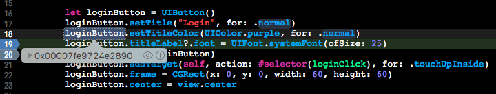
### 2. 条件断点调试
   可以对普通断点的属性进行配置，设置条件，使调试更加方便达到目的。如下循环中：
    ```
  for i in 0..<10 {
      print(i)
  }
    ```
   如果要调试循环中的代码，每次都要单步执行，可能这并不是我想要的。我想要在一定条件的时候中断程序进行调试，可以如图添加Condition：
   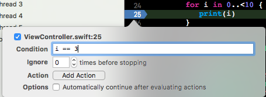
   可以设置Ignore参数，会忽略前面n次的断点，会在第n+1次中断：
   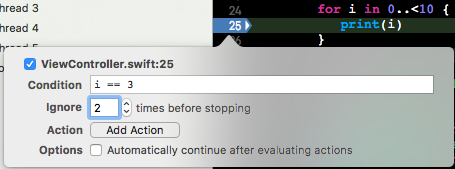
   可以查看某个函数被调用的次数，设置Action参数,要选中
   Automatically continue after evaluating actions。
   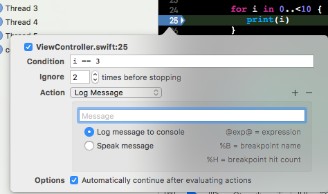
### 3. 异常断点调试
   有时候由于异常导致后程序crash了，代码就直接断到main函数中去了，这时候调试就比较麻烦。这种情况就可以用异常断点调试方法进行调试。如图添加异常断点：
   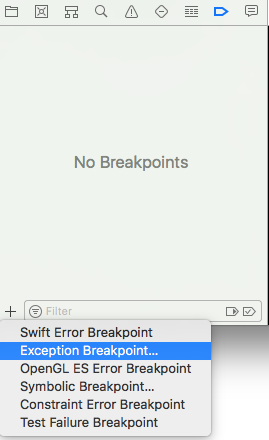
### 4. 符号断点Symbolic Breakpoint调试
   符号断点的创建也和异常断点一样。一般符号断点可以在你指定的[类名 方法名]时中断执行。
   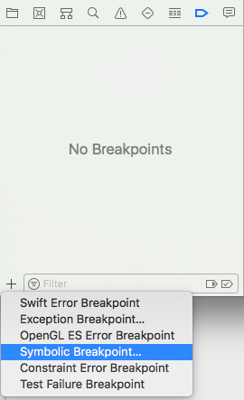
   如果Symbol只写了一个函数名，那么就会在出现该函数名的地方中断执行。
   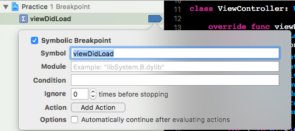
### 5. Analyze分析器
   Analyze分析器是一种静态的工具，可以对我们的程序进行分析，找出我们未使用的变量，或一些死存储。执行Analyze如下：Product-->Analyze。快捷键为: Command+Ctrl+B
   可以设置在编译程序的时候同时Analyze，把下列选项设为Yes即可。
   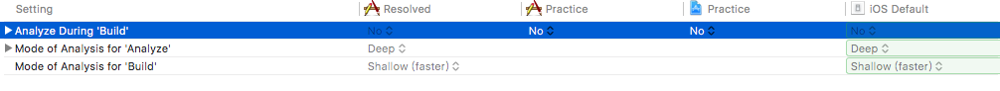
### 6. 僵尸对象
   iOS中把那些已经release但还没完全消失的对象叫做僵尸对象，对已经release的对象再次释放，就会发生异常。虽然自从使用ARC后，由于对象释放产生的异常已经大大变少，但偶尔还会出现。开启僵尸对象模式后，就能快速定位到异常位置。
   开启方式如下：Product-->Scheme-->Edit Scheme. 勾选Zombie Objects即可。
   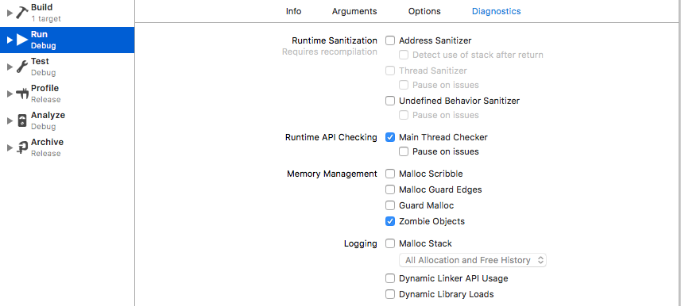
### 7. lldb命令调试
#### (1) print、po输出打印：
   打印变量的值可以使用print（简写p）命令，该命令如果打印的是基础数据类型，则会列出基础数据类型的类型和值。如果是对象，还会打印出对象指针地址。print的打印信息较多，如果只想查看对象的值，则可以使用po（printobject）命令。
   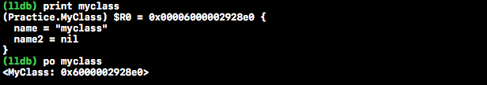
#### (2) call:
   call调用方法的意思，call可以使用在没有返回值，不需要显示输出的情况下。比如可以这样用：
   ```  
  call self.view.backgroundColor = UIColor.purple
   ```
   这样就不用为了看改一下颜色的效果再进行build一次了，尤其是build一次还要经过漫长的等待。
  
#### (3) expression表达式(expr):
   expr常用于调试时修改变量的值。比如：
   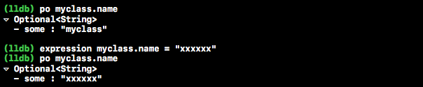
#### (4) image:
   image lookup --address寻址。比如：
   ```
   (lldb) image lookup --address 0x00000001097c396f
   ```
   image lookup --type查看类型.比如：
   ```
  (lldb) image lookup --type UIButton
   ```
   可以列出UIButton所有的属性。
#### (5) bt:
   我们可以用bt来打印调用堆栈，加all可打印多个thread的堆栈，如下：
   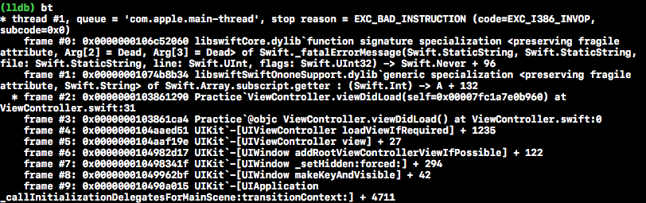
### 8. 视图调试
   当在调看UI布局或者在布局产生冲突的时候可以使用视图调试解决问题。进入APP出现问题的那个界面然后点击Xcode Debug View Hierarchy, 如图：
   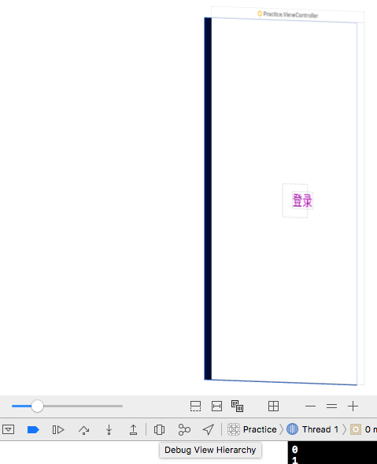
### 9. Log调试
   可以使用别人的Log工具或者自定义Log，按照需求自行选择。